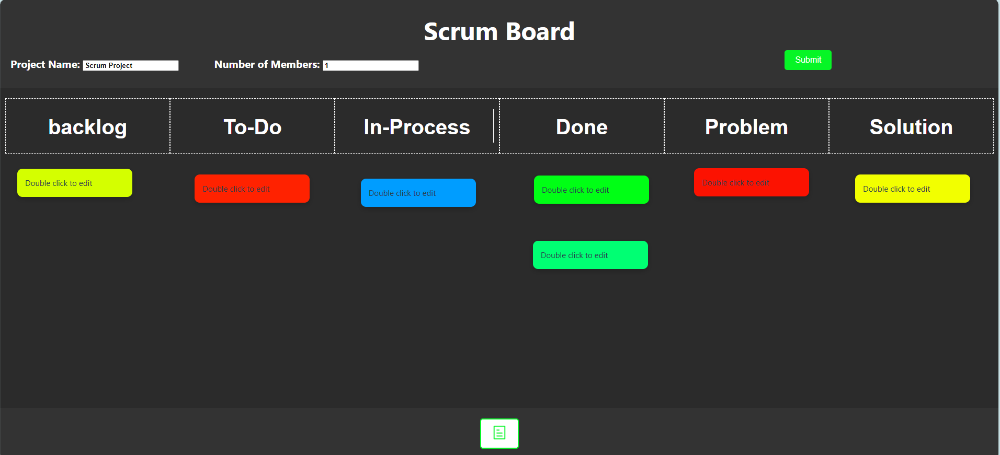

# Scrum Tool

A simple Scrum board tool built with Vue.js and Element Plus, designed to help manage your agile workflow effectively. You can create tasks, organize them into categories like Backlog, To-Do, In-Process, Done, and Problem, and manage notes dynamically.




## Features

- **Task Management**: Create, update, and manage tasks across multiple columns.
- **Sticky Notes**: Add and manage sticky notes dynamically on the board.
- **Custom Columns**: Customize the column headers to fit your project needs.
- **Responsive Layout**: Works across multiple devices with a fluid layout.
- **Chalkboard UI**: Stylish chalkboard-like UI for an engaging experience.

## Demo
【Video Clip for ScrumBoard】 https://www.bilibili.com/video/BV1FVzEYsEMG/?
share_source=copy_web&vd_source=79d1f3947abd2f658f6e6303271d4fb3

## Project Features
```php
scrumTool
├── src
│   ├── main
│   │   ├── java
│   │   │   ├── com.example.scrumtool
│   │   │       ├── controller          # REST API controllers
│   │   │       │   └── Controller.java  # Handles API requests
│   │   │       ├── dao                 # Data Access Objects (DAO)
│   │   │       │   ├── ProjectInfo.java # Represents project entities
│   │   │       │   └── User.java        # Represents user entities
│   │   │       ├── mapper              # Mappers for database interactions
│   │   │       │   ├── ProjectBaseMapper.java # Mapper for project data
│   │   │       │   └── UserMapper.java        # Mapper for user data
│   │   │       └── ScrumtoolApplication.java # Main application class
│   │   ├── resources
│   │       ├── assets                 # Static assets like images and icons
│   │       ├── application.yml        # Application configuration
│   │       ├── index.html             # Frontend entry file
│   │       └── schema.sql             # Database schema definitions
│   ├── test                          # Unit and integration tests
│       └── ...                        # Test files
├── .mvn                              # Maven wrapper files
├── HELP.md                           # Help documentation
├── pom.xml                           # Project metadata and dependencies
├── README.md                         # Project documentation
ui
├── src
│   ├── assets         # Static assets like images and icons
│   ├── components     # Vue components
│   ├── views          # Different views for the application
│   ├── App.vue        # Main application component
│   ├── main.js        # Application entry point
├── public             # Public files (index.html, favicon, etc.)
├── package.json       # Project metadata and dependencies
├── README.md          # Project documentation
└── ... 
```

## Getting Started

### Prerequisites

Make sure you have java18、vue3、Node.js and npm installed on your system.

- [Node.js](https://nodejs.org/en/download/) (version 12.x or higher)
- [npm](https://www.npmjs.com/get-npm)

### Installation

Follow these steps to get started:

1. Clone the repository:
    ```bash
    git clone https://github.com/your-username/scrum-tool.git
    cd scrum-tool
    ```

2. Install the dependencies:
    ```bash
    cd ui
    npm install
    ```

3. Run the application in development mode:
    ```bash
    npm run serve
    ```

4. run the backend server

5. Open the app in your browser:
    ```
    http://localhost:5173
    ```

  
### Building for Production

To create a production build:

```bash
npm run build
```

## Contributing
Contributions are welcome! Please follow these steps:

Fork the repository.
1. Create a new branch for your feature (git checkout -b feature-name).
2. Commit your changes (git commit -m 'Add some feature').
3. Push to the branch (git push origin feature-name).
4. Open a pull request.

## License
This project is licensed under the MIT License. See the [LICENSE](https://mit-license.org/) file for details.
