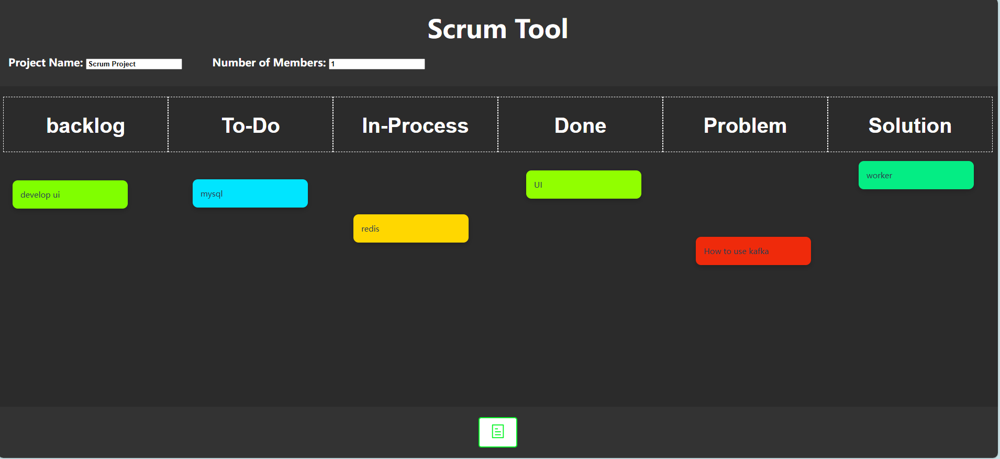

# Scrum 工具

这是一个使用 Vue.js 和 Element Plus 构建的简单 Scrum 看板工具，旨在帮助您高效管理敏捷工作流程。您可以创建任务，将它们分类为 Backlog（待办事项）、To-Do（待处理）、In-Process（进行中）、Done（已完成）和 Problem（问题），并动态管理便签。



## 功能

- **任务管理**：在多个列中创建、更新和管理任务。
- **便签管理**：动态添加和管理看板上的便签。
- **自定义列**：可以根据项目需求自定义列标题。
- **响应式布局**：支持多设备访问，提供流畅的布局体验。
- **黑板风格 UI**：时尚的黑板风格界面，提升用户体验。

## 演示

待更新

## 项目结构
```php
├── src
│   ├── assets         # 静态资源，例如图片和图标
│   ├── components     # Vue 组件
│   ├── views          # 应用程序的不同视图
│   ├── App.vue        # 主应用组件
│   ├── main.js        # 应用程序的入口文件
├── public             # 公共文件 (index.html, favicon 等)
├── package.json       # 项目信息和依赖管理
├── README.md          # 项目文档
└── ...
```

## 入门指南

### 先决条件

确保您的系统上已安装 Node.js 和 npm。

- [Node.js](https://nodejs.org/en/download/) (版本 12.x 或更高)
- [npm](https://www.npmjs.com/get-npm)

### 安装步骤

按照以下步骤开始：

1. 克隆此仓库：
    ```bash
    git clone https://github.com/your-username/scrum-tool.git
    cd scrum-tool
    ```

2. 安装依赖项：
    ```bash
    npm install
    ```

3. 在开发模式下运行应用程序：
    ```bash
    npm run serve
    ```

4. 在浏览器中打开应用：
    ```
    http://localhost:5173
    ```

### 生产环境构建

若要为生产环境创建构建版本，请运行：

```bash
npm run build
```

## 贡献

欢迎贡献！请按照以下步骤进行：

1. Fork 此仓库。
2. 创建一个新分支以开发新功能 (git checkout -b feature-name)。
3. 提交更改 (git commit -m 'Add some feature')。
4. 推送到该分支 (git push origin feature-name)。
5. 提交一个 Pull Request。

## 许可证

此项目遵循 MIT 许可证。有关详细信息，请查看 [LICENSE](https://mit-license.org/) 文件。